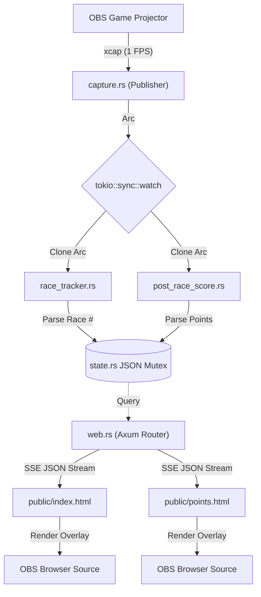

# MKWorld Metric Tracker: Design Document

## 1. Executive Summary
The MKWorld Metric Tracker is a pure-Rust, strictly-local computer vision microservice built to extract real-time telemetry from a live Mario Kart gameplay feed (via OBS Window Projectors) and surface those metrics to stylized OBS Browser Source overlays.

It was designed specifically to bypass the limitations of memory-reading hacks or API sniffing, relying entirely on visual Optical Character Recognition (OCR). To support multiple simultaneous analytical tasks without massive frame lag, the system implements an asynchronous **Multi-Agent Event Bus** architecture.

## 2. Overall High-Level Architecture (The Event Bus)
The core design philosophy is drastically decoupled: **Capture, Analyze, and Serve** act independently. 

1. **The Publisher:** A single thread captures a desktop screenshot every 1 second. It wraps the raw bytecode in an `Arc<>` (Atomic Reference Counted pointer) to share ownership without cloning the heavy 1080p image matrix array. It pushes this pointer across a `tokio::sync::watch` channel.
2. **The Agents (Subscribers):** Multiple asynchronous worker task agents "listen" to the watch channel. When a new frame arrives, they each grab a pointer reference, crop their specific isolated "Region of Interest" (ROI) on the screen, and run expensive Neural-Network OCR parallel to one another.
3. **The State & Server:** Agents extract integers and mutate a single central JSON `SharedState` mutex. An Axum HTTP server continuously queries this state and streams it to OBS browser sources using stateless Server-Sent Events (SSE).

## 3. Detailed Component Breakdown

### Core Infrastructure
**`src/main.rs` (The Orchestrator)**  
The main executable bootstraps the Tokio runtime. It initializes the `CancellationToken` for graceful shutdown handling (binding to `SIGINT`/Ctrl+C), loads the `rten` deep learning OCR models once into memory, spawns the central `tokio::sync::watch` channel, and dynamically spins up the different Agent threads alongside the Axum web server.
It also outputs a highly detailed Diagnostic Dashboard to the native terminal immediately upon booting, specifically detailing what input logic it expects the user to fulfill (e.g. verifying an active OBS Projector) and exactly what `http://localhost:3000` sub-paths are exposed for OBS Browser Sources.

**`src/state.rs` (The Central Nervous System)**  
Maintains the `AppState` global struct representing the current data context (Race Number, Running Score). Exposed to agents via `Arc<Mutex<AppState>>`, it acts as a thread-safe unified JSON payload store. It also implements time-based cooldown logic (e.g. ignoring false-positive OCR scans of "1st Race" if that race was already triggered within the last 120 seconds).

### The Telemetry Pipeline
**`src/capture.rs` (The Publisher)**  
A highly optimized infinite loop using the `xcap` crate. It interrogates the OS window manager for any UI window containing the word "Projector" in its title. It grabs the active RGBA window bitmap memory at exactly 1 Frame Per Second (FPS). If OBS is closed, it drops into a 0% CPU standby loop until the window reappears.

### The Analysis Microservices
**`src/agents/race_tracker.rs`**  
Listens to the telemtry stream. Upon receiving a frame, it mathematically slices out the absolute bottom 30% of the image (where the `nth Race` graphic appears). It iterates directly over the `RgbaImage` bytes to apply a "Binarization Threshold"—converting all visually complex graphical yellow/gradient backgrounds into pure stark-white (#FFFFFF) and the white lettering into pure black (#000000). The `rten` OCR reads the high-contrast cropped matrix, and a forgiving Regex isolates strings like `2nd race`. 

**`src/agents/post_race_score.rs`**  
Operates identically to the `race_tracker`, but crops the horizontal center-to-right portion of the screen (from Y:15% to 85%), creating an isolated matrix of the post-game scoreboard block. It scans every optical line found within the grid. If it triggers a substring match against a pre-configured player alias, it performs another resilient Regex `(?:\s+|^)(\d{1,3})\s*$` to yank the running score integer resting at the far-edge of that specific string.

### The UI Edge Interfaces
**`src/web.rs` (The Websocket Simulator)**  
A robust Axum web server. When requested at `/events`, it spawns an async generator wrapping the central `state.rs` payload, yielding an HTTP `text/event-stream` stream every 2 seconds. This pushes serialized JSON down to active clients without relying on the clients to constantly request it manually.

**`public/*.html` (The Frontends)**  
Lightweight display templates (like `index.html` and `points.html`) strictly utilizing browser-native internal HTML/CSS. 
- **The Design:** Implements the "MKWorld" dark-mode glassmorphism aesthetic (.mmr-display layer bounds, inset silver ring shadow styling). 
- **The Failover Script:** A Javascript loop binds a native `EventSource` connection to the Axum backend. To bypass Chromium CEF's fatal glitch architecture (where OBS Browser Sources normally permanently freeze if the local Axum server crashes and drops the TCP connection), the UI implements aggressive self-healing socket teardowns and `setTimeout(3000)` exponential backoffs to force a reconnection retry infinitely until you restart your Rust executable.
